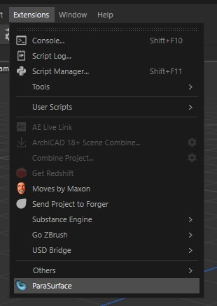
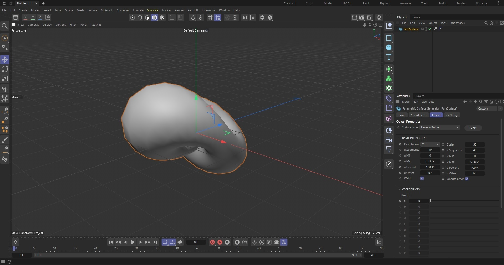
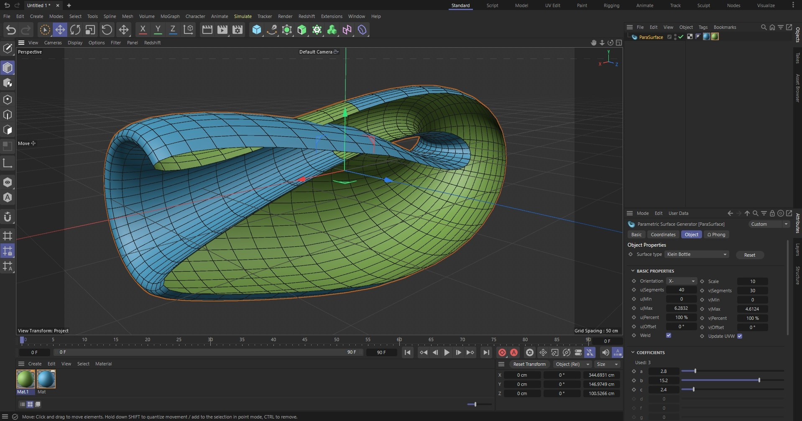
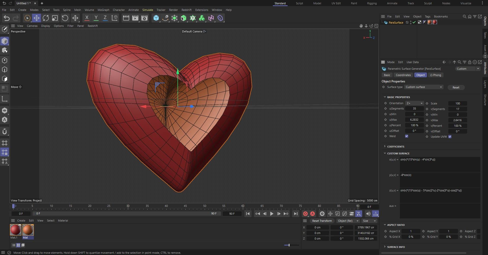

¡Welcome to the official repository of the ParaSurface plugin for Cinema4D!

## :low_brightness:Description
This plugin allows you to **create** and **animate** any ***3D parametric surface*** represented by the equations **x(u,v), y(u,v) and z(u,v)**, and has a lot of predefined surfaces to play with.

There are multiple animatable parameters, from the number of points across the u and v axis to the value of the coefficients (constants) used in the equations. Also, you can change general properties as the scale, the orientation, the aspect ratio, and even the grid(u,v) surface relation. Check the tutorial below! . :point_down:

You can download it for free at https://jmmorph.gumroad.com/l/ParaSurface just typing "0" in the price section, or other quantity if you want to make a donation. You can also clone this repository or directly download the .zip file from github.

## :pencil: Tutorial

### Installation:
To install the ParaSurface plugin for Cinema 4D:

1.  Download the plugin or clone this repo.
2.  Unzip the downloaded archive and copy the "ParaSurface" folder into the Cinema 4D plugins directory, this is:
	- Windows:  `C:\Program Files\MAXON\CINEMA 4D RXX\plugins\`
	- Mac OS:  `/Applications/MAXON/CINEMA 4D RXX/plugins/`

### Use:

After installation and restart of the program, in order to add a parametric surface just go to Extensions -> ParaSurface.

A new generator will be added to the scene! By default a Lawson Klein Bottle will be the surface shown, and you can change the surface type and its parameters.

All parameters are defined by the classic GUI elements from cinema 4D, like float fields, sliders, text boxes, etc... you can customize the parameters used by the predefined surfaces like this:

Or select the surface type: "Custom" and write your own equations using python mathematical syntax (just operators and symbols), for example:

## :information_desk_person: General Info

**Repository Objective:**

This repository aims to facilitate collaboration on various development projects tailored for Cinema 4D. Unlike my other projects, this isn't merely a scene file with Python supplements; rather, it's a fully customized plugin. It serves as a valuable reference for your upcoming projects and, especially if you're an artist, provides a platform for creating stunning visual art.

### Cinema 4D Version Compatibility:

 - [x] 2024.4.2
 - [x] 2023.0.1

### Change Log:

 - **Version 1.0**
	 - Plugin creation, thoroughly tested with all predefined surfaces.

### :clipboard: File Structure

The plugin adheres to the development guidelines outlined at [Maxon Developer Docs](https://developers.maxon.net/docs/py/2024_2_0/index.html). 

The `.surf` format file defines default parameters for predefined parametric surfaces. Customize the `custom.surf` file to create your own predefined surfaces. Note that creating new files with the `.surf` format won't affect the current version. Deleting any `.surf` file might lead to unexpected behavior when attempting to use the corresponding missing surface file.

### :page_with_curl: License

This project operates under the MIT License with additional specifications. You are free to *use, modify,* and/or *distribute* the software. Notably, you can make ***commercial use*** of the **products generated with it.** However, you are expressly prohibited from **selling** any ***copies*** of the plugin or integrating it into commercial software products **without prior permission**.
